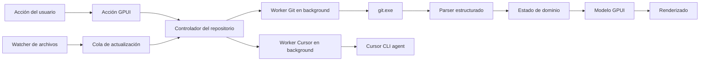

# Especificación funcional y técnica: Git Helper

## 1. Resumen

Git Helper será una aplicación de escritorio nativa para Windows que permita trabajar con varios repositorios Git locales desde una única ventana.

Cada repositorio se abrirá en una pestaña independiente. Desde ella se podrá:

- Consultar el estado del working tree.
- Ver archivos modificados, nuevos, eliminados, renombrados y en conflicto.
- Añadir y quitar archivos del staging area.
- Descartar cambios locales.
- Crear commits.
- Generar mensajes de commit mediante Cursor CLI.
- Ejecutar fetch, pull y push.
- Consultar el historial de commits.

La interfaz se implementará en Rust con **GPUI**, el framework gráfico creado por Zed. El objetivo principal es una aplicación rápida y ligera que reproduzca el flujo compacto de la pestaña Source Control de Zed, añadiendo pestañas superiores para cambiar entre proyectos.

## 2. Decisiones técnicas obligatorias

| Área | Decisión |
|---|---|
| Plataforma inicial | Windows 10 y Windows 11 de 64 bits |
| Lenguaje | Rust estable más reciente compatible con GPUI |
| UI | GPUI oficial de `zed-industries/zed` |
| Integración con Git | Ejecutable `git.exe` instalado en el sistema |
| Generación de mensajes | Comando `agent` de Cursor CLI en modo headless y Ask |
| Persistencia local | Archivo JSON en `%LOCALAPPDATA%\GitHelper\state.json` |
| Ejecución asíncrona | Tareas de Git fuera del hilo de UI mediante los executors de GPUI |
| Distribución inicial | Ejecutable y paquete de instalación para Windows |

GPUI sigue siendo pre-1.0 y su API puede cambiar. La dependencia debe fijarse a un `rev` concreto del repositorio oficial de Zed; no se debe depender de `main` sin fijar. El agente deberá documentar el commit utilizado y actualizar `Cargo.lock`.

No se usará Electron, Tauri, WebView, HTML, CSS ni JavaScript.

Se usará el CLI de Git en lugar de `libgit2` para respetar la configuración, credenciales, hooks, filtros, atributos y comportamiento del Git instalado por el usuario.

Cursor CLI será una integración opcional: la aplicación seguirá permitiendo escribir y crear commits manualmente si `agent` no está instalado, no está autenticado o está deshabilitado por una política de organización.

### 2.1 Zed como implementación de referencia

Este proyecto no parte de una referencia conceptual: Zed ya implementa con GPUI prácticamente todo el flujo de Source Control solicitado. El agente implementador debe revisar primero el código oficial de [zed-industries/zed](https://github.com/zed-industries/zed) y reutilizar o adaptar las partes compatibles en lugar de reconstruirlas sin necesidad.

Referencias directas:

| Necesidad | Implementación de Zed que debe revisarse |
|---|---|
| Panel completo, estado, stage/unstage, commit, descarte, tabs Changes/History y generación de mensaje | [`crates/git_ui/src/git_panel.rs`](https://github.com/zed-industries/zed/blob/main/crates/git_ui/src/git_panel.rs) |
| Prompt usado por Zed para generar mensajes de commit | [`crates/git_ui/src/commit_message_prompt.txt`](https://github.com/zed-industries/zed/blob/main/crates/git_ui/src/commit_message_prompt.txt) |
| Vista y datos de commits | [`crates/git_ui/src/commit_view.rs`](https://github.com/zed-industries/zed/blob/main/crates/git_ui/src/commit_view.rs) y [`crates/git/src/commit.rs`](https://github.com/zed-industries/zed/blob/main/crates/git/src/commit.rs) |
| Integración y salida de operaciones remotas | [`crates/git_ui/src/remote_output.rs`](https://github.com/zed-industries/zed/blob/main/crates/git_ui/src/remote_output.rs) y [`crates/git/src/remote.rs`](https://github.com/zed-industries/zed/blob/main/crates/git/src/remote.rs) |
| Selector y cambio entre repositorios | [`crates/git_ui/src/repository_selector.rs`](https://github.com/zed-industries/zed/blob/main/crates/git_ui/src/repository_selector.rs) |
| Estado y modelo Git | [`crates/git/src/status.rs`](https://github.com/zed-industries/zed/blob/main/crates/git/src/status.rs) y [`crates/git/src/repository.rs`](https://github.com/zed-industries/zed/blob/main/crates/git/src/repository.rs) |
| Configuración del panel | [`crates/git_ui/src/git_panel_settings.rs`](https://github.com/zed-industries/zed/blob/main/crates/git_ui/src/git_panel_settings.rs) |
| Commit que introdujo la vista History | [`61da34c`](https://github.com/zed-industries/zed/commit/61da34c69fbe28428765b700bb34f6691962fa36) |


La reutilización se organizará así:

1. Identificar en `GitPanel` las entidades GPUI, acciones, listas virtualizadas, tabs internas, estados de carga, menús y patrones de renderizado que encajen con este MVP.
2. Portar únicamente las partes necesarias y eliminar dependencias propias del editor, como `Workspace`, `Project`, `Editor`, multibuffers, lenguaje, colaboración o telemetría.
3. Mantener la diferencia principal de Git Helper: cada pestaña superior es una sesión de repositorio independiente y persistente; Zed utiliza un panel ligado al workspace y un repositorio activo.
4. Conservar el flujo y densidad visual de Zed, pero sustituir su acceso Git interno por el `GitClient` tipado definido en esta especificación cuando importar la implementación de Zed arrastre dependencias innecesarias.
5. No portar las vistas de diff, branch diff, blame, stash, conflictos visuales ni git graph, ya que están fuera del MVP.
6. Documentar en una tabla `origen de Zed → módulo adaptado → cambios realizados` cualquier código copiado o derivado.

## 3. Objetivos

### 3.1 Objetivos del MVP

1. Abrir varios repositorios locales y representarlos como pestañas.
2. Recordar y restaurar los repositorios abiertos y la pestaña activa.
3. Mostrar el estado Git de cada repositorio.
4. Hacer stage y unstage de archivos individuales o de todos los cambios.
5. Descartar cambios locales con confirmación explícita.
6. Crear commits a partir de los cambios staged.
7. Generar una propuesta editable de mensaje de commit mediante Cursor CLI.
8. Ejecutar fetch, pull y push sobre el remote correspondiente.
9. Mostrar una lista navegable del historial de commits.
10. Actualizar la interfaz cuando cambie el repositorio, sin bloquear la ventana.
11. Mostrar errores accionables y conservar intacto el repositorio ante fallos.
12. Consultar ramas locales y referencias remote-tracking sin cambiar el checkout.

### 3.2 Fuera del MVP

- Inicializar repositorios vacíos desde cero.
- Crear, eliminar, fusionar o hacer checkout de ramas.
- Rebase, cherry-pick, revert, stash y reset.
- Edición de archivos.
- Visualización de diffs.
- Stage de líneas o fragmentos.
- Resolver conflictos mediante una herramienta visual.
- Submódulos como repositorios navegables.
- Soporte oficial para macOS o Linux.
- Integración con GitHub, GitLab, Bitbucket o Azure DevOps.

Estas funciones no deben añadirse durante el MVP salvo que sean necesarias para su arquitectura interna.

### 3.3 Clonado por SSH (SSH-01)

Git Helper admite obtener repositorios remotos accesibles mediante SSH sin un clonado manual previo fuera de la aplicación.

Flujo:

1. El usuario elige **Clonar repositorio** (`Ctrl+Shift+O`) e introduce una URL SSH (`git@host:org/repo.git` o `ssh://user@host/path/repo.git`).
2. La aplicación valida el formato antes de tocar la red y rechaza esquemas no SSH (`https://`, `file://`, etc.).
3. Se propone un destino bajo `%LOCALAPPDATA%\GitHelper\repos\<nombre>`. Con el selector nativo se elige la carpeta contenedora y el clon se crea dentro, en `<carpeta>\<nombre>`.
4. Si el destino ya contiene un repositorio Git —no un subdirectorio de otro— con el mismo `origin` canónico, se ofrece abrirlo sin sobrescribir. Un destino ocupado por otro contenido o por otro `origin` se rechaza con un mensaje explícito.
5. En caso contrario se ejecuta `git clone <url> <destino>` con progreso, cancelación y errores SSH accionables.
6. Tras un clonado correcto se abre el repositorio en una pestaña y se persiste el par `(ssh_url_normalizada, ruta_local)` en `state.json`.

Requisitos y limitaciones:

- Git Helper usa el stack SSH del sistema (`GIT_SSH`, `~/.ssh/config`, `ssh-agent`); no almacena claves ni contraseñas.
- Los errores frecuentes (host desconocido, clave ausente, timeout, host key changed) se resumen en la UI con indicaciones prácticas.
- La URL se normaliza a `ssh://host[:puerto]/ruta` para comparar remotes: el puerto no estándar y el caso de la ruta forman parte de la identidad del repositorio.
- Un clonado cancelado o fallido borra el destino que haya creado, de modo que el siguiente intento parte de cero.
- HTTPS, editor de `~/.ssh/config`, gestión visual de claves y trabajo remoto sin clon local quedan fuera de alcance.

## 4. Experiencia de usuario

### 4.1 Ventana principal

La ventana tendrá estas áreas:

1. **Barra de pestañas de repositorios**
	- Una pestaña por repositorio.
	- Nombre de la carpeta como título.
	- Ruta completa en tooltip.
	- Indicador de cambios pendientes.
	- Indicador visual de carga o error.
	- Botón para cerrar cada pestaña.
	- Botón `+` para abrir otro repositorio.

2. **Barra de acciones**
	- Nombre de la rama actual o `HEAD separado`.
	- Información de upstream y contadores ahead/behind cuando existan.
	- Acción `Fetch`.
	- Botón principal `Pull` con menú desplegable para `Pull`, `Push` y `Fetch`.
	- Acción `Actualizar estado`.

3. **Contenido**
	- Dos pestañas internas: `Cambios (n)` e `Historial`.
	- `Cambios` muestra una lista compacta de archivos y el formulario de commit en una única columna.
	- `Historial` muestra un inventario de ramas locales y referencias remote-tracking y una lista compacta de commits en la misma área, sin abrir otra ventana ni cambiar de proyecto.

4. **Barra de estado**
	- Ruta del repositorio.
	- Estado de la última operación.
	- Versión de Git detectada.

### 4.2 Estado sin repositorios

Al iniciar sin repositorios abiertos se mostrará:

- Título y explicación breve.
- Botón `Abrir repositorio`.
- Botón `Clonar repositorio` para URLs SSH.
- Lista opcional de repositorios recientes que sigan existiendo.
- Lista opcional de clones SSH recientes cuya ruta local siga existiendo.

El selector de carpeta debe ser nativo de Windows. Una carpeta es válida si:

```text
git -C <ruta> rev-parse --show-toplevel
```

termina correctamente. Si se selecciona una subcarpeta, se abrirá la raíz canónica devuelta por Git. No se abrirán dos pestañas para la misma ruta canónica.

### 4.3 Vista Cambios

Los archivos se agruparán en este orden:

1. `Conflictos`
2. `Cambios staged`
3. `Cambios`
4. `Sin seguimiento`

Cada grupo:

- Muestra el número de elementos.
- Puede expandirse o contraerse.
- Tiene una acción contextual para stage o unstage de todos los archivos aplicables.

Cada fila de archivo muestra:

- Nombre.
- Ruta relativa secundaria.
- Código de estado: `M`, `A`, `D`, `R`, `C`, `U` o `?`.
- Checkbox o acción equivalente al final de la fila para stage o unstage.
- Menú contextual con `Descartar cambios` cuando sea aplicable.

Un mismo archivo puede aparecer tanto en `Cambios staged` como en `Cambios` si tiene modificaciones en ambos estados. Cada fila controla únicamente el estado que representa.

Seleccionar una fila solo la resalta y habilita sus acciones. El MVP no leerá ni mostrará el contenido ni el diff del archivo.

### 4.4 Stage y unstage

Comandos requeridos:

```text
git -C <repo> add -- <ruta>
git -C <repo> add -A
git -C <repo> restore --staged -- <ruta>
git -C <repo> restore --staged .
```

Para repositorios sin commit inicial, donde `restore --staged` no sea aplicable, se implementará un fallback seguro mediante:

```text
git -C <repo> rm --cached -- <ruta>
```

o el comando equivalente validado por pruebas de integración. No se debe borrar el archivo del working tree.

Después de cualquier operación se actualizarán el estado y el historial si el HEAD ha cambiado.

Las acciones:

- Permanecerán deshabilitadas mientras exista otra mutación Git activa para ese repositorio.
- No bloquearán operaciones de solo lectura en otras pestañas.
- Mostrarán stderr si fallan.
- No asumirán que el estado previo sigue vigente después de ejecutar el comando.

### 4.5 Descartar cambios

Descartar es una operación destructiva y siempre requiere un diálogo modal de confirmación que muestre las rutas afectadas y avise de que no se puede deshacer desde la aplicación.

Comportamiento:

- Para cambios tracked no staged, restaurar el working tree desde el índice con `git restore --worktree -- <ruta>`.
- Para archivos untracked, eliminarlos con `git clean -f -- <ruta>`; para un directorio untracked seleccionado explícitamente, usar `git clean -fd -- <ruta>`.
- Para descartar un cambio staged, restaurar índice y working tree desde `HEAD` mediante `git restore --source=HEAD --staged --worktree -- <ruta>`.
- En un repositorio sin commit inicial no existe `HEAD`: la UI debe explicar que descartar un archivo staged implicaría eliminar contenido y exigir primero hacer unstage. No debe improvisar un comando alternativo.
- `Descartar todo` requiere una segunda confirmación más destacada y solo afecta a los elementos enumerados en el diálogo.
- Los conflictos no se pueden descartar desde el MVP; deben resolverse fuera de la aplicación.

Antes de eliminar un archivo untracked se volverá a consultar su estado. La ruta debe seguir dentro de la raíz canónica del repositorio y continuar siendo untracked. Nunca se usarán `git clean -x`, `git clean -X` ni un pathspec vacío.

Después de confirmar, el diálogo permanecerá bloqueado mientras se ejecuta la operación. Si alguna ruta falla, se mostrará un resultado parcial por archivo y se refrescará el estado real.

### 4.6 Commit

La vista `Cambios` tendrá:

- Caja de texto multilínea para el mensaje.
- Contador de caracteres.
- Botón con icono de generación mediante Cursor junto a la caja.
- Botón `Commit`.
- Texto que indique cuántos archivos staged se incluirán.

Reglas:

- El botón se deshabilita si no hay cambios staged, el mensaje está vacío o existe otra mutación en curso.
- No se hace stage automático al crear un commit.
- Se conservan los saltos de línea del mensaje.
- El mensaje se pasa por stdin con `git commit --file=-`; no se concatena en una cadena de shell.
- Se respetan los hooks configurados por el usuario.
- Si faltan `user.name` o `user.email`, se muestra el error de Git y una indicación de cómo configurarlos, pero la aplicación no modifica la configuración.
- Si un hook rechaza el commit, el mensaje escrito se conserva.
- Tras un commit correcto, se limpia la caja, se refresca todo el repositorio y el nuevo HEAD aparece al principio de `Historial`.

### 4.7 Generación del mensaje con Cursor CLI

La generación solo se inicia mediante una acción explícita del usuario y requiere al menos un cambio staged. Nunca crea el commit automáticamente.

Flujo:

1. Detectar el comando `agent` mediante `PATH` o una ruta configurable.
2. Validar la instalación con `agent --version`.
3. Consultar autenticación con `agent status --format json` cuando esté disponible.
4. Obtener contexto únicamente de los cambios staged.
5. Mostrar una advertencia y solicitar consentimiento la primera vez que se vaya a enviar código a Cursor.
6. Invocar Cursor CLI sin shell, escribir el prompt por stdin y cerrar stdin.
7. Extraer el campo `result` de la salida JSON.
8. Insertar la propuesta en la caja de commit para que el usuario pueda editarla, sustituirla o descartarla.

Invocación base:

```text
agent -p --mode ask --workspace <repo> --output-format json
```

No se usarán `--force`, `--yolo`, `--trust` ni `--api-key`. La aplicación no realizará login ni guardará credenciales: si es necesario, mostrará instrucciones para ejecutar `agent login` fuera de la aplicación. Si una organización deshabilita el modo headless, se mostrará como restricción de política.

El prompt contendrá:

- Una instrucción para devolver exclusivamente un mensaje de commit breve, sin Markdown ni explicaciones.
- La lista `name-status` staged.
- El `numstat` staged.
- El diff staged textual, solo como contexto interno para Cursor; este diff nunca se renderiza en la UI.
- Como máximo los últimos 20 asuntos de commit para inferir idioma y convención.

El contexto se obtiene mediante comandos Git estructurados y se limita a 200 KiB. Se excluye contenido binario. Si se supera el límite, se incluyen todos los nombres y estadísticas, y se trunca el contenido en límites de archivo, indicando esta circunstancia en el prompt.

Antes del primer uso, la aplicación informará claramente de que el contexto se envía a Cursor y posiblemente a proveedores de modelos. El consentimiento se podrá revocar desde ajustes. No se registrarán el prompt, el diff, la respuesta JSON completa ni el mensaje generado.

Cursor CLI se considera un proceso potencialmente influido por reglas del repositorio. Se ejecutará en modo `ask` y con la configuración de permisos más restrictiva compatible con la versión instalada. El resultado se tratará como texto no confiable: solo se insertará en la caja y posteriormente se enviará a Git por stdin.

La UI tendrá estados `Generando…`, `Cancelar`, éxito y error. Un error o cancelación conserva el mensaje que ya hubiese escrito el usuario.

### 4.8 Sincronización remota

La barra inferior o de acciones seguirá el patrón compacto de Zed: rama actual a la izquierda y botón de sincronización con menú desplegable a la derecha.

#### Fetch

- Si la rama tiene upstream, usar su remote.
- Si no tiene upstream y existe un único remote, usarlo.
- Si hay varios remotes, solicitar uno mediante un selector.
- Ejecutar `git fetch <remote>` sin `--prune` implícito.

#### Pull

- Requiere una rama con upstream.
- Ejecutar `git pull --ff-only` para evitar merges o rebases implícitos.
- Si hay divergencia, mostrar el error y pedir al usuario que la resuelva fuera de la aplicación.
- Si hay cambios locales que impiden el pull, no hacer stash automático.

#### Push

- Con upstream configurado, ejecutar `git push`.
- Sin upstream, solicitar remote y confirmación para ejecutar `git push --set-upstream <remote> <branch>`.
- No permitir push desde detached HEAD en el MVP.
- Nunca usar `--force` ni `--force-with-lease`.

Git Credential Manager puede mostrar su propia UI. Los procesos deben configurar `GIT_TERMINAL_PROMPT=0` para no quedar esperando una terminal invisible. Si la autenticación requiere interacción no gráfica, se mostrará el error y se indicará que debe configurarse fuera de Git Helper.

Fetch, pull y push se ejecutan en background, muestran progreso indeterminado y permiten cancelar el proceso. Mientras haya una operación remota mutante en un repositorio, sus acciones incompatibles permanecen deshabilitadas, pero las otras pestañas siguen operativas. Al finalizar se refrescan status, upstream, ahead/behind e historial.

### 4.9 Vista Historial

El historial mostrará inicialmente hasta 200 commits y tendrá una acción `Cargar más`.

Cada fila incluirá:

- Hash abreviado.
- Asunto del commit.
- Autor.
- Fecha relativa y fecha local en tooltip.
- Ramas y tags como badges cuando existan.

La consulta base será equivalente a:

```text
git -C <repo> log --all --date-order --decorate=full <formato-estructurado>
```

El formato debe usar separadores NUL o un formato inequívoco. El MVP presenta una lista cronológica compacta como la vista History de Zed; no calcula ni dibuja lanes de un git graph.

Al seleccionar una fila se podrá mostrar en la parte inferior el hash completo, cuerpo, autor, committer, fechas, padres y referencias. No se mostrará el diff ni el contenido de los archivos del commit.

La vista de historial permite seleccionar una rama local o referencia remote-tracking. La consulta
se ejecuta con `git log` sobre el OID de la referencia, sin hacer checkout ni modificar `HEAD`, el
índice o el working tree. Las ramas locales indican su upstream configurado, los contadores
`ahead/behind`, la ausencia de upstream o un upstream que ya no existe. `origin/HEAD` y otras
referencias simbólicas se excluyen del inventario. Las referencias remotas representan el último
`fetch` disponible localmente.

### 4.10 Atajos

| Atajo | Acción |
|---|---|
| `Ctrl+O` | Abrir repositorio |
| `Ctrl+Shift+O` | Clonar repositorio por SSH |
| `Ctrl+W` | Cerrar pestaña activa |
| `Ctrl+Tab` | Siguiente repositorio |
| `Ctrl+Shift+Tab` | Repositorio anterior |
| `F5` | Actualizar repositorio activo |
| `Ctrl+1` | Abrir vista Historial |
| `Ctrl+2` | Abrir vista Cambios |
| `Ctrl+Enter` | Crear commit cuando el foco esté en el mensaje |
| `Ctrl+Shift+G` | Generar mensaje de commit con Cursor |

Los botones deben tener tooltip y las acciones principales deben poder ejecutarse con teclado.

## 5. Modelo de dominio

Los nombres de tipos, variables, funciones y métodos estarán en inglés. Los comentarios y la documentación interna se escribirán en español.

Tipos conceptuales mínimos:

```rust
struct AppState {
	repositories: Vec<RepositorySession>,
	active_repository_id: Option<RepositoryId>,
	recent_repositories: Vec<PathBuf>,
	settings: AppSettings,
}

struct RepositorySession {
	id: RepositoryId,
	root_path: PathBuf,
	snapshot: RepositorySnapshot,
	selected_view: RepositoryView,
	selected_change: Option<ChangeSelection>,
	selected_commit: Option<CommitId>,
	refresh_state: RefreshState,
	mutation_state: MutationState,
	status_message: String,
	error: Option<String>,
}

struct RepositorySnapshot {
	head: HeadState,
	upstream: Option<UpstreamState>,
	remotes: Vec<Remote>,
	changes: Vec<FileChange>,
	commits: Vec<CommitSummary>,
}

struct FileChange {
	path: PathBuf,
	original_path: Option<PathBuf>,
	index_status: ChangeKind,
	worktree_status: ChangeKind,
	is_conflicted: bool,
}

enum ChangeKind {
	Unmodified,
	Added,
	Modified,
	Deleted,
	Renamed,
	Copied,
	Unmerged,
	Untracked,
}
```

El diseño final puede adaptar estos tipos a GPUI, pero debe mantener separado:

- Estado persistido de la aplicación.
- Estado efímero de UI.
- Modelo de dominio Git.
- Ejecución y análisis de comandos Git.
- Componentes de presentación.

## 6. Arquitectura propuesta

```text
git-helper/
├── Cargo.toml
├── Cargo.lock
├── rust-toolchain.toml
├── README.md
├── assets/
│   ├── icons/
│   └── fonts/
├── src/
│   ├── main.rs
│   ├── app.rs
│   ├── actions.rs
│   ├── domain/
│   │   ├── mod.rs
│   │   ├── repository.rs
│   │   ├── status.rs
│   │   ├── commit.rs
│   │   ├── remote.rs
│   │   └── history.rs
│   ├── git/
│   │   ├── mod.rs
│   │   ├── client.rs
│   │   ├── command.rs
│   │   ├── status_parser.rs
│   │   ├── log_parser.rs
│   │   └── error.rs
│   ├── cursor/
│   │   ├── mod.rs
│   │   ├── client.rs
│   │   ├── context_builder.rs
│   │   └── response_parser.rs
│   ├── persistence/
│   │   ├── mod.rs
│   │   └── app_state_store.rs
│   ├── ui/
│   │   ├── mod.rs
│   │   ├── theme.rs
│   │   ├── main_window.rs
│   │   ├── repository_tabs.rs
│   │   ├── toolbar.rs
│   │   ├── changes_view.rs
│   │   ├── change_list.rs
│   │   ├── commit_form.rs
│   │   ├── discard_dialog.rs
│   │   ├── sync_menu.rs
│   │   ├── history_view.rs
│   │   ├── commit_details.rs
│   │   └── components/
│   └── watcher/
│       ├── mod.rs
│       └── repository_watcher.rs
└── tests/
    ├── fixtures/
    ├── git_client_integration.rs
    └── persistence_integration.rs
```

La separación es orientativa. Se priorizarán módulos con una API pequeña y responsabilidades claras; no se crearán abstracciones vacías solo para reproducir esta estructura.

### 6.1 Flujo de datos



### 6.2 Cliente Git

`GitClient` será la única puerta de acceso a procesos Git. Debe:

- Usar `std::process::Command` o una abstracción tipada equivalente.
- Pasar siempre los argumentos por separado.
- No invocar `cmd.exe`, PowerShell ni construir comandos mediante interpolación.
- Configurar `-C <repo>` explícitamente.
- Capturar exit code, stdout y stderr.
- Poder enviar datos por stdin.
- Soportar cancelación o ignorar resultados obsoletos mediante un identificador de generación.
- Conservar rutas Windows como `Path`/`OsStr` mientras sea posible.
- Tratar correctamente espacios, caracteres Unicode y rutas largas.
- Fijar `LC_ALL=C` únicamente si resulta aplicable en Git for Windows y está cubierto por pruebas; los parsers no deben depender de mensajes localizados.

Al iniciar, se ejecutará `git --version`. Si Git no existe, se mostrará una pantalla de error con enlace o instrucciones para instalar Git for Windows y un botón para reintentar.

### 6.3 Lectura del estado

Se usará:

```text
git status --porcelain=v2 --branch -z --untracked-files=all
```

El parser debe admitir:

- Registros ordinarios.
- Renames y copies con ruta original.
- Entradas unmerged.
- Entradas untracked.
- Cabeceras branch, upstream, ahead y behind.
- Rutas con espacios, tabs, saltos de línea y caracteres no ASCII.
- Repositorios con HEAD separado.
- Repositorios sin commits.

No se analizará la salida humana de `git status`.

### 6.4 Operaciones remotas

La capa Git expondrá métodos tipados para `fetch`, `pull` y `push`; la UI no construirá argumentos directamente. Antes de cada operación resolverá branch, upstream y remotes mediante:

```text
git branch --show-current
git remote
git rev-parse --abbrev-ref --symbolic-full-name @{upstream}
```

Los datos que se puedan obtener desde `status --porcelain=v2 --branch` no se consultarán de nuevo innecesariamente. Los nombres de remote y branch se pasan como argumentos separados y nunca se aceptan como opciones: deben validarse y situarse después de `--` cuando el subcomando Git lo soporte.

La cancelación termina el proceso hijo y sus pipes sin cerrar la aplicación. Se establecerá un timeout configurable y razonable para detectar procesos bloqueados, pero una operación remota activa no se considerará fallida solo por tardar varios segundos.

### 6.5 Cliente de Cursor CLI

`CursorClient` compartirá una abstracción segura de ejecución de procesos con `GitClient`, pero tendrá tipos de resultado y errores separados. Debe:

- Resolver `agent` mediante `PATH` y permitir configurar una ruta explícita.
- Comprobar versión y estado de autenticación sin hacerlo en cada generación.
- Invocar únicamente print mode con `--mode ask` y salida JSON.
- Enviar el prompt por stdin; no incluir contexto de código en argumentos.
- Parsear un objeto JSON cuyo `type` sea `result`, comprobar `is_error` y leer `result`.
- Ignorar campos JSON desconocidos para tolerar ampliaciones compatibles.
- Tratar exit code distinto de cero, stdout no válido y stderr como errores diferenciados.
- No asumir una codificación no documentada sin validar UTF-8 y ofrecer un error legible.
- Permitir cancelación y descartar respuestas de una generación antigua.
- No heredar una API key desde configuración propia ni aceptar claves en la UI.

La ruta física del ejecutable, el esquema de `agent status` y los modelos disponibles no se consideran contratos estables. La integración debe aislar estas variaciones detrás de `CursorClient`.

### 6.6 Concurrencia

- Nunca se ejecutará Git de forma síncrona en el hilo principal de GPUI.
- Cada repositorio tendrá como máximo una operación mutante activa.
- Las lecturas de repositorios distintos podrán ejecutarse en paralelo.
- Cada repositorio tendrá como máximo una generación de mensaje activa.
- Las solicitudes repetidas de refresh se agruparán con debounce de aproximadamente 250 ms.
- Cada refresh tendrá un número de generación. Un resultado antiguo no reemplazará un estado más reciente.
- Al cerrar una pestaña se cancelarán sus watchers y se ignorarán resultados pendientes.
- La UI mostrará el último snapshot válido mientras llega uno nuevo.

### 6.7 Detección de cambios

Se vigilarán, como mínimo:

- El working tree, excluyendo `.git`.
- `.git/index`.
- `.git/HEAD`.
- Referencias relevantes dentro de `.git/refs`.
- La ubicación real de Git obtenida mediante `git rev-parse --git-dir`, ya que puede ser un archivo o estar fuera del working tree.

Los eventos se agruparán antes de refrescar. También se refrescará:

- Al recuperar el foco de la ventana.
- Después de toda operación mutante.
- Mediante `F5`.

Si el watcher pierde eventos o falla, la aplicación debe seguir siendo utilizable con refresh manual. Se permite un polling moderado como fallback mientras la ventana tenga foco.

### 6.8 Persistencia

Se persistirá:

- Versión del esquema.
- Rutas de repositorios abiertos.
- Orden de las pestañas.
- Repositorio activo.
- Últimos repositorios abiertos.
- Vista seleccionada por repositorio.
- Tamaño y posición válidos de la ventana.
- Tema seleccionado.
- Ruta configurada de Cursor CLI, si la hubiera.
- Consentimiento informado para enviar contexto staged a Cursor.
- Pares `(ssh_url_normalizada, ruta_local)` de clones SSH recientes.
- Carpeta de clonado por defecto configurable.

No se persistirán:

- Credenciales ni claves SSH.
- Salida de comandos.
- Contenido de archivos o contexto enviado a Cursor.
- Mensajes de commit después de un commit correcto.

La escritura será atómica: archivo temporal y rename. Un JSON corrupto no impedirá iniciar; se registrará el error, se conservará una copia recuperable y se arrancará con estado vacío.

## 7. Diseño visual

El aspecto debe ser compacto y propio de una herramienta de desarrollo:

- Tema oscuro inicial, con tema claro y opción de seguir Windows.
- Tipografía de interfaz legible y monoespaciada para hashes y rutas.
- Densidad similar a VS Code o Zed.
- Bordes y separadores discretos.
- Estados hover, focus, pressed, disabled, loading y error claramente diferenciados.
- Icono y letra de estado para diferenciar tipos de cambio sin depender solo del color.
- Iconos SVG consistentes, preferiblemente de una colección con licencia compatible.

Las capturas de Source Control de Zed y su implementación open source son la referencia funcional y de densidad: pestañas internas `Changes`/`History`, lista de una columna, barra de rama y sincronización, caja de commit y acciones compactas. El código solo se podrá copiar conforme a su licencia; los recursos visuales, marcas y logotipos no se copiarán.

Las listas de archivos y commits deben virtualizarse para evitar renderizar todas las filas simultáneamente.

## 8. Errores y observabilidad

### 8.1 Errores visibles

Los errores se mostrarán cerca de la acción que falló y podrán expandirse para ver detalles técnicos. Deben distinguirse:

- Git no instalado.
- Ruta inexistente.
- Carpeta que no es repositorio.
- Repositorio eliminado mientras estaba abierto.
- Permisos insuficientes.
- Índice bloqueado.
- Commit rechazado por hook.
- Configuración de identidad ausente.
- Salida Git no reconocida.
- Remote o upstream ausente.
- Autenticación Git fallida o cancelada.
- Pull no fast-forward.
- Cursor CLI no instalado, no autenticado o bloqueado por política.
- Respuesta inválida o cancelación de Cursor CLI.

No se ocultará stderr ni se mostrará únicamente un mensaje genérico.

### 8.2 Logging

Se escribirá un log rotativo en `%LOCALAPPDATA%\GitHelper\logs` con:

- Inicio y cierre.
- Versión de aplicación, GPUI, Git y Cursor CLI cuando esté disponible.
- Duración y resultado de comandos, sin registrar mensajes de commit ni contenido de archivos.
- Errores de parsing y persistencia.
- Fallos del watcher.

No se registrarán credenciales, variables de entorno sensibles ni contenido del repositorio.

## 9. Seguridad e integridad

- No ejecutar comandos arbitrarios proporcionados por el repositorio.
- No usar una shell para invocar Git ni Cursor CLI.
- No alterar configuración global o local de Git.
- Las operaciones destructivas se limitan a `Descartar` y requieren confirmación explícita con las rutas afectadas.
- No seguir enlaces ni abrir rutas externas sin acción explícita del usuario.
- Respetar hooks de Git en commits y mostrar sus errores.
- No elevar privilegios.
- No enviar telemetría propia.
- Las únicas operaciones de red son fetch, pull, push y la generación solicitada mediante Cursor CLI.
- El estado local, stage, unstage, descarte, commit e historial deben funcionar offline. La indisponibilidad de red no debe impedir el resto de la aplicación.
- Advertir que el contexto enviado a Cursor puede contener secretos o datos personales. Aplicar una detección básica de patrones sensibles y pedir confirmación adicional si se detectan, sin prometer que esta detección sea completa.

## 10. Rendimiento

Objetivos medibles en un equipo Windows de desarrollo actual:

- Primera ventana visible en menos de 1 segundo, excluyendo instalación y cold start excepcional.
- Interacción de pestañas y scroll a 60 FPS en condiciones normales.
- Ninguna operación Git bloquea la UI durante más de un frame.
- Estado de un repositorio con 10.000 cambios procesado sin agotar memoria y mostrado mediante lista virtualizada.
- Carga inicial de 200 commits en menos de 1 segundo para un repositorio local típico.
- Refresh incremental percibido en menos de 500 ms después de estabilizarse los eventos del filesystem.
- Contexto total enviado a Cursor limitado a 200 KiB.

Estos valores son objetivos, no razones para omitir el manejo correcto de errores.

## 11. Accesibilidad

- Navegación completa mediante teclado para acciones principales.
- Focus ring visible.
- Orden de tabulación predecible.
- Contraste suficiente en ambos temas.
- Tooltips para botones con icono.
- Etiquetas de texto accesibles donde GPUI permita semántica de accesibilidad.
- Respeto por el escalado de pantalla de Windows y prueba al 100 %, 125 %, 150 % y 200 %.

## 12. Pruebas

### 12.1 Unitarias

- Parser de `status --porcelain=v2 -z`.
- Parser del formato estructurado de `git log`.
- Clasificación de cambios staged, unstaged, untracked y conflictivos.
- Resolución de remote y upstream para fetch, pull y push.
- Validación de rutas y construcción de planes de descarte.
- Construcción limitada del contexto para Cursor.
- Parser tolerante de la respuesta JSON de Cursor CLI.
- Serialización, migración y recuperación del estado persistido.
- Reducción de eventos del watcher.
- Rechazo de resultados de generaciones antiguas.

Los fixtures deben incluir rutas con:

- Espacios.
- Unicode.
- Tabs.
- Saltos de línea válidos para Git.
- Renames.
- Archivos eliminados.

### 12.2 Integración

Las pruebas crearán repositorios temporales reales y usarán el Git instalado:

1. Repositorio vacío sin commit inicial.
2. Historial lineal.
3. Rama y merge.
4. Archivo staged y modificado de nuevo.
5. Rename.
6. Conflicto de merge.
7. Stage y unstage individual.
8. Stage y unstage de todos.
9. Commit correcto.
10. Commit rechazado por hook.
11. Ruta con espacios y caracteres Unicode.
12. Restauración de sesiones persistidas.
13. Descarte de cambio tracked, staged y untracked.
14. Rechazo del descarte de conflicto y de rutas fuera del repositorio.
15. Fetch, pull fast-forward y push contra un remote bare temporal local.
16. Pull divergente rechazado sin modificar la historia.
17. Primera publicación mediante `--set-upstream`.
18. Cursor CLI simulado: éxito, error, timeout, cancelación y JSON desconocido.

Cada prueba configurará identidad Git solo dentro del repositorio temporal. Nunca modificará la configuración global.
Las pruebas de Cursor usarán un ejecutable fake o un `ProcessRunner` inyectado y no enviarán código real a la red.

### 12.3 UI y validación manual

Se preparará una lista reproducible para validar:

- Apertura y cierre de pestañas.
- Restauración tras reiniciar.
- Cambio rápido entre varios repositorios.
- Resize y escalado DPI.
- Tema claro y oscuro.
- Estados loading, vacío y error.
- Atajos.
- Stage, unstage, descarte y commit.
- Generación editable con Cursor y consentimiento inicial.
- Fetch, pull y push, incluidos los casos sin upstream y de error.
- Cambio entre las pestañas internas `Cambios` e `Historial`.
- Scroll de miles de archivos y cientos de commits.

## 13. Criterios de aceptación del MVP

El MVP se considera terminado cuando:

1. Compila en Windows con un único procedimiento documentado.
2. Abre al menos cinco repositorios simultáneamente en pestañas.
3. Restaura pestañas y pestaña activa después de reiniciar.
4. Refleja correctamente todos los estados Git definidos en esta especificación.
5. Permite stage y unstage individual y global sin modificar indebidamente el working tree.
6. No muestra ni ofrece una vista de diff.
7. Descarta cambios solo después de confirmación y afecta exactamente a las rutas enumeradas.
8. Crea commits únicamente con los cambios staged y conserva el mensaje ante errores.
9. Cursor CLI genera una propuesta editable sin ejecutar el commit y sus fallos no bloquean el flujo manual.
10. Fetch, pull fast-forward y push funcionan con upstream; la primera publicación solicita remote y confirmación.
11. Nunca se ejecuta un push forzado ni un pull que cree merge o rebase implícito.
12. El historial presenta commits, autor, fecha, hash y referencias en una lista compacta paginada.
13. Se actualiza después de cambios externos y permite refresh manual.
14. La UI sigue respondiendo durante todos los comandos Git y Cursor.
15. Funciona con rutas que contienen espacios y Unicode.
16. Todas las pruebas unitarias y de integración pasan.
17. `cargo fmt --check` y `cargo clippy --all-targets --all-features -- -D warnings` pasan.
18. No contiene telemetría ni operaciones Git destructivas fuera del descarte confirmado.
19. README documenta requisitos, compilación, ejecución, arquitectura, privacidad y limitaciones conocidas.

## 14. Fases de implementación

### Fase 1: Bootstrap de GPUI

- Crear el proyecto Rust.
- Fijar un commit compatible de GPUI.
- Abrir una ventana en Windows.
- Añadir logging, tema base y manejo global de errores.
- Documentar requisitos de Rust, Git for Windows, Visual Studio Build Tools y Windows SDK.

### Fase 2: Capa Git

- Implementar `GitClient`.
- Detectar y validar repositorios.
- Implementar y probar parser de status.
- Implementar stage, unstage, descarte y commit.
- Implementar fetch, pull y push tipados.

### Fase 3: Sesiones y pestañas

- Implementar estado de aplicación.
- Abrir, cerrar, seleccionar y restaurar repositorios.
- Añadir persistencia atómica.
- Evitar pestañas duplicadas.

### Fase 4: Source control

- Implementar lista agrupada y virtualizada.
- Añadir acciones stage/unstage.
- Añadir descarte con confirmación.
- Añadir formulario de commit y acciones de sincronización.

### Fase 5: Historial y Cursor CLI

- Implementar parser de log.
- Renderizar lista de historial virtualizada, refs y detalle de commit.
- Añadir paginación.
- Implementar detección, contexto limitado e invocación segura de Cursor CLI.
- Añadir consentimiento, generación editable, cancelación y errores.

### Fase 6: Actualización y robustez

- Añadir watchers y debounce.
- Resolver carreras con generaciones.
- Añadir límites de contexto para Cursor y timeouts de procesos.
- Completar estados vacíos y de error.

### Fase 7: Calidad y distribución

- Completar pruebas.
- Medir rendimiento.
- Validar DPI y accesibilidad.
- Crear icono, metadatos de versión y paquete de instalación.
- Completar README y limitaciones conocidas.

Cada fase debe terminar compilando y con sus pruebas correspondientes. No se debe posponer toda la integración de GPUI hasta el final.

## 15. Reglas para el agente implementador

1. Antes de escribir componentes complejos, fijar un SHA de Zed y revisar `crates/git_ui/src/git_panel.rs` y los demás archivos de referencia indicados en la sección 2.1.
2. Reutilizar los patrones y, cuando la licencia elegida lo permita, adaptar el código de Zed que reduzca riesgo y trabajo; no inventar APIs de GPUI ni mezclar ejemplos de revisiones incompatibles.
3. Mantener commits pequeños y funcionales por fase.
4. Escribir nombres de código en inglés y documentación/comentarios en español.
5. Evitar `unwrap()` y `expect()` en rutas recuperables de producción; convertir errores en estados visibles o errores tipados.
6. No silenciar warnings de Clippy sin justificarlo.
7. No bloquear el hilo de UI.
8. No hacer parsing de salida Git destinada a humanos.
9. No añadir funciones fuera del MVP antes de cumplir sus criterios de aceptación.
10. Si una limitación real de GPUI impide un requisito, documentar la evidencia y proponer la adaptación mínima antes de cambiar el alcance.

## 16. Entregables

- Código fuente completo.
- `Cargo.lock` reproducible.
- Assets con sus licencias.
- Pruebas unitarias y de integración.
- README de desarrollo y uso.
- Instalador o procedimiento reproducible de empaquetado para Windows.
- Documento breve de decisiones técnicas, incluyendo el `rev` de GPUI.
- Archivo de licencia, avisos y atribuciones exigidos por todo código reutilizado.
- Tabla de trazabilidad del código adaptado desde Zed con archivo de origen, SHA y módulo de destino.
- Lista de limitaciones conocidas y backlog posterior al MVP.
