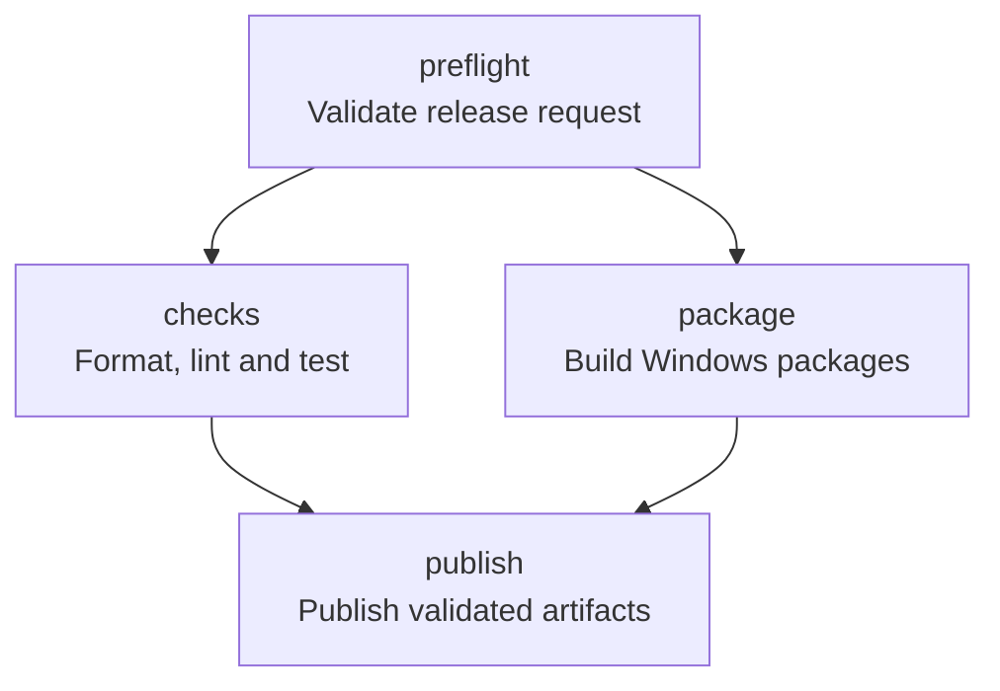

# Empaquetado para Windows

## Requisitos

- Los requisitos de compilación descritos en `README.md`.
- [WiX Toolset 3.14](https://wixtoolset.org/docs/wix3/).
- `cargo-wix` 0.3.9.
- `cargo-license` para regenerar `docs/dependency-licenses.txt`.

Git Helper usa Apache-2.0 (`LICENSE`). La plantilla WiX versionada está en `wix/main.wxs`.

## Procedimiento reproducible

```powershell
cargo test --all-targets
cargo clippy --all-targets --all-features -- -D warnings
cargo fmt --check
cargo build --release --locked

cargo license --avoid-dev-deps --avoid-build-deps --do-not-bundle > docs\dependency-licenses.txt

cargo install cargo-wix --version 0.3.9 --locked
cargo wix --nocapture
```

Si WiX no está en `PATH`, instalar el toolset y reiniciar la consola:

```powershell
winget install --id WiXToolset.WiXToolset --exact
```

El MSI resultante se crea en `target\wix`. Incluye:

- `target\release\git-helper.exe` y `target\release\ghelper.exe`.
- `LICENSE`.
- `THIRD_PARTY_NOTICES.md`.
- Icono propio multirresolución `assets/icon.ico`, compartido por el ejecutable y el instalador.

La configuración de empaquetado vive en `[package.metadata.wix]` dentro de `Cargo.toml`. Los GUID de
actualización y de `PATH` están fijados para permitir upgrades in-place.

Los artefactos actuales no se firman con Authenticode. Las releases incluyen `SHA256SUMS.txt` para
comprobar su integridad; la firma queda pendiente para una fase posterior:

```powershell
cargo wix sign
```

## Publicación automatizada

El workflow `.github/workflows/release.yml` ejecuta formato, Clippy, pruebas, build release y
`cargo-wix` en un runner oficial de Windows. Después publica el MSI, un ZIP portable y sus hashes
SHA-256 en GitHub Releases. Se activa al subir una etiqueta `vMAJOR.MINOR.PATCH` o manualmente desde
GitHub Actions, y exige que la versión coincida con `Cargo.toml`.

El pipeline valida primero la versión y que la release no exista en el job `preflight`. Solo
después se ejecutan en paralelo los jobs `checks` y `package`; `publish` depende de ambos, descarga
el artefacto ya construido y comprueba su SHA, nombres versionados y checksums antes de publicar. No
recompila en ese job. Solo `publish` dispone de `contents: write`.



La ejecución manual admite `dry_run`, que recorre el pipeline completo sin crear una release, y
`failure_mode=checks|package`, que provoca un fallo controlado. En ambos casos puede comprobarse en
el grafo de Actions que `publish` queda bloqueado si falla cualquiera de sus dos dependencias.

Para comprobar las puertas sin publicar:

```text
gh workflow run release.yml \
  --repo NdeFrutos/git-helper \
  --ref main \
  -f version=0.1.1 \
  -f dry_run=true \
  -f failure_mode=checks
```

Repita con `failure_mode=package` y, para medir tiempos, con `failure_mode=none` en una ejecución
fría y otra caliente del mismo SHA.

## Diseño de la caché de Cargo

CI y release comparten el mismo diseño de caché, definido en `.github/workflows/ci.yml` y
`.github/workflows/release.yml`. Se cachean `~/.cargo/registry`, `~/.cargo/git`, `~/.cargo/bin`,
`~/.cargo/.crates.toml`, `~/.cargo/.crates2.json` y `target`.

Existen dos claves independientes porque los perfiles no comparten artefactos:

Clave | Quién la escribe | Quién la lee
--- | --- | ---
`…-cargo-checks-…` | job `checks` de CI y de release | los mismos jobs (perfil dev)
`…-cargo-release-…` | job `warm-release-cache` en `main` | job `package` de release (perfil release)

Ambas claves tienen esta forma:

```
<os>-<arch>-cargo-<checks|release>-<CARGO_CACHE_VERSION>[-wix<CARGO_WIX_VERSION>]-<hash entorno>-<hash entradas>
```

- `CARGO_CACHE_VERSION` es una variable de entorno del workflow. Se sube a mano cuando cambia el
  diseño de la caché (rutas, pasos o flags del runner) y no hay ningún fichero cuyo hash lo refleje.
- `CARGO_WIX_VERSION` solo forma parte de la clave de release, que es la única que reutiliza el
  binario de `~/.cargo/bin`.
- El *hash de entorno* es `hashFiles('rust-toolchain.toml', '.cargo/config.toml')`: versión del
  toolchain y flags del linker.
- El *hash de entradas* es `hashFiles('Cargo.lock', 'Cargo.toml', 'build.rs')`. `Cargo.toml` entra en
  la clave porque contiene `[profile.*]`, features y la metadata de WiX: cambiarlos altera los
  artefactos de `target` sin tocar `Cargo.lock`.

Las `restore-keys` degradan por prefijo, de modo que un cambio de lockfile aún reutiliza el registro
y los artefactos del toolchain anterior en lugar de partir de cero. Ninguna clave incluye
`github.ref`: así una PR o una release pueden restaurar la caché escrita en `main`.

`.github/scripts/ensure-cargo-wix.ps1` comprueba la versión real de `cargo-wix.exe` antes de decidir
si instala. Con `restore-keys` una restauración parcial puede traer un binario de otra versión, así
que no basta con comprobar que el fichero existe: si la versión no coincide se reinstala con
`--force` y se verifica después. Cambiar `CARGO_WIX_VERSION` invalida además la clave exacta.

### Qué invalida qué

Cambio | Efecto
--- | ---
`rust-toolchain.toml` o `.cargo/config.toml` | invalida ambas claves por completo (compilador o linker distintos)
`Cargo.lock`, `Cargo.toml` o `build.rs` | invalida la clave exacta; se restaura por prefijo la caché del mismo toolchain
`CARGO_WIX_VERSION` | invalida la clave de release y fuerza la reinstalación verificada de `cargo-wix`
`CARGO_CACHE_VERSION` | invalida todas las cachés a propósito

## Medición de la caché

`.github/scripts/report-cargo-cache.ps1` se ejecuta al final de cada job cacheado y publica en el
resumen de Actions la duración del job, si hubo acierto exacto, la clave realmente restaurada y el
tamaño en disco de cada ruta cacheada. Los tamaños son del contenido descomprimido; el archivo que
GitHub almacena es bastante menor (zstd), y el límite del repositorio es de 10 GB.

Mediciones tomadas en la PR de la issue #22 (`windows-latest`, job `Checks`, perfil dev, mismo
lockfile y mismo toolchain en ambas):

Ejecución | Acierto exacto | Trabajo del job | Tamaño en disco
--- | --- | ---: | ---:
Fría ([run 34594828329](https://github.com/NdeFrutos/git-helper/actions/runs/34594828329)) | no, ninguna clave restaurada | 408 s (job completo 7 min 36 s, incluida la subida de la caché) | PENDIENTE_FRIA_TAMANO
Caliente ([run PENDIENTE_CALIENTE_RUN](https://github.com/NdeFrutos/git-helper/actions/runs/PENDIENTE_CALIENTE_RUN)) | PENDIENTE_CALIENTE_HIT | PENDIENTE_CALIENTE_TIEMPO | PENDIENTE_CALIENTE_TAMANO

Desglose del tamaño en la ejecución fría: `target` 2448,5 MB, `~/.cargo/git` 846,6 MB,
`~/.cargo/registry` 360,1 MB y `~/.cargo/bin` 169,9 MB (esta última la ocupa sobre todo el
herramental preinstalado del runner). El archivo comprimido que se subió a la caché ocupó 1,44 GB,
así que dos claves vivas (checks y release) caben holgadamente en el límite de 10 GB, pero no habría
sitio para muchas más variantes simultáneas: por eso las claves se mantienen acotadas y sin
`github.ref`.

Para repetir la medición en el perfil release sin publicar nada, lanzar `Release` con
`workflow_dispatch`, `dry_run=true` y `failure_mode=none` sobre `main`: el job `package` debe
indicar acierto exacto contra la caché que dejó `warm-release-cache` y reutilizar `cargo-wix` sin
reinstalarlo cuando la versión coincide.

## Medición del pipeline de release

Cada job registra su duración y si obtuvo una coincidencia exacta de caché. El resumen final muestra
el tiempo de pared y la suma de minutos de runner, que deben conservarse para una ejecución fría y
otra caliente del mismo SHA mediante `dry_run`.

Fase | Tiempo observado antes de CI-02 | Tiempo tras CI-02
--- | ---: | ---:
Checks (Clippy + tests) | 6 min 16 s | Lo registra el resumen de Actions
Build + WiX + MSI | 6 min 49 s | Lo registra el resumen de Actions
Tiempo de pared total | aproximadamente 13 min | Objetivo inicial 7–8 min; validar con dos dry-runs

La cifra de 7–8 minutos es una hipótesis, no una garantía. No se crea ninguna etiqueta ni release
para obtener estas mediciones.

## Validación posterior al empaquetado

Seguir el checklist de [`docs/visual-validation.md`](visual-validation.md) en el binario release y,
si procede, tras instalar el MSI.
