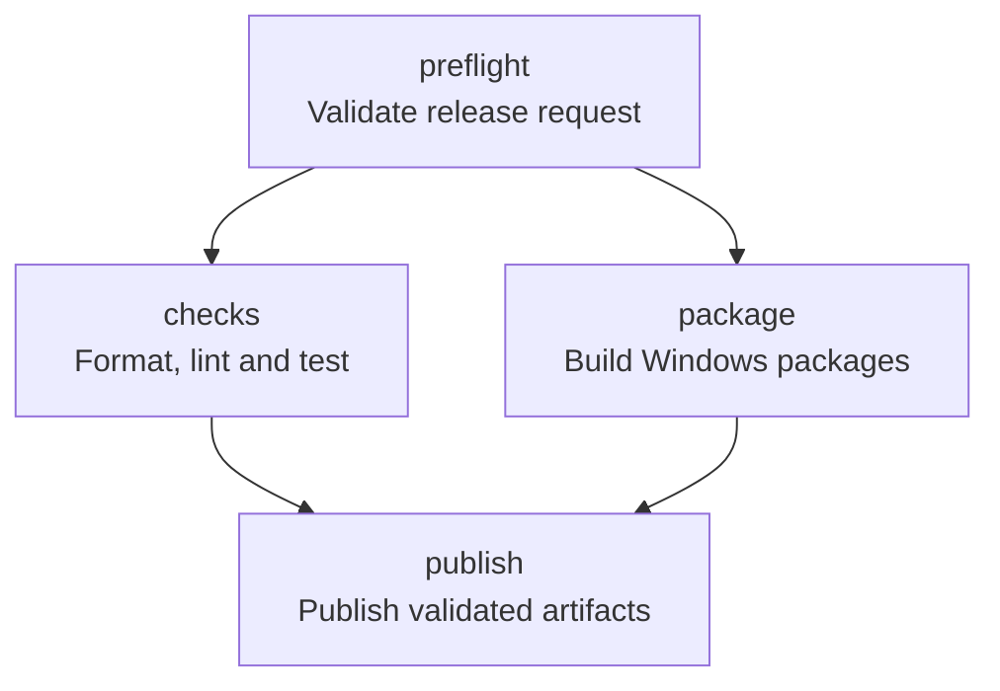

# Empaquetado para Windows

## Requisitos

- Los requisitos de compilación descritos en `README.md`.
- [WiX Toolset 3.14](https://wixtoolset.org/docs/wix3/).
- `cargo-wix` 0.3.9.
- `cargo-license` para regenerar `docs/dependency-licenses.txt`.

Git Helper usa Apache-2.0 (`LICENSE`). La plantilla WiX versionada está en `wix/main.wxs`.

## Procedimiento reproducible

```powershell
cargo test --all-targets
cargo clippy --all-targets --all-features -- -D warnings
cargo fmt --check
cargo build --release --locked

cargo license --avoid-dev-deps --avoid-build-deps --do-not-bundle > docs\dependency-licenses.txt

cargo install cargo-wix --version 0.3.9 --locked
cargo wix --nocapture
```

Si WiX no está en `PATH`, instalar el toolset y reiniciar la consola:

```powershell
winget install --id WiXToolset.WiXToolset --exact
```

El MSI resultante se crea en `target\wix`. Incluye:

- `target\release\git-helper.exe`.
- `LICENSE`.
- `THIRD_PARTY_NOTICES.md`.
- Icono propio multirresolución `assets/icon.ico`, compartido por el ejecutable y el instalador.

La configuración de empaquetado vive en `[package.metadata.wix]` dentro de `Cargo.toml`. Los GUID de
actualización y de `PATH` están fijados para permitir upgrades in-place.

Los artefactos actuales no se firman con Authenticode. Las releases incluyen `SHA256SUMS.txt` para
comprobar su integridad; la firma queda pendiente para una fase posterior:

```powershell
cargo wix sign
```

## Publicación automatizada

El workflow `.github/workflows/release.yml` ejecuta formato, Clippy, pruebas, build release y
`cargo-wix` en un runner oficial de Windows. Después publica el MSI, un ZIP portable y sus hashes
SHA-256 en GitHub Releases. Se activa al subir una etiqueta `vMAJOR.MINOR.PATCH` o manualmente desde
GitHub Actions, y exige que la versión coincida con `Cargo.toml`.

El pipeline valida primero la versión y que la release no exista en el job `preflight`. Solo
después se ejecutan en paralelo los jobs `checks` y `package`; `publish` depende de ambos, descarga
el artefacto ya construido y comprueba su SHA, nombres versionados y checksums antes de publicar. No
recompila en ese job. Solo `publish` dispone de `contents: write`.



La ejecución manual admite `dry_run`, que recorre el pipeline completo sin crear una release, y
`failure_mode=checks|package`, que provoca un fallo controlado. En ambos casos puede comprobarse en
el grafo de Actions que `publish` queda bloqueado si falla cualquiera de sus dos dependencias.

Para comprobar las puertas sin publicar:

```text
gh workflow run release.yml \
  --repo NdeFrutos/git-helper \
  --ref main \
  -f version=0.1.1 \
  -f dry_run=true \
  -f failure_mode=checks
```

Repita con `failure_mode=package` y, para medir tiempos, con `failure_mode=none` en una ejecución
fría y otra caliente del mismo SHA.

## Medición del pipeline de release

Cada job registra su duración y si obtuvo una coincidencia exacta de caché. El resumen final muestra
el tiempo de pared y la suma de minutos de runner, que deben conservarse para una ejecución fría y
otra caliente del mismo SHA mediante `dry_run`.

Fase | Tiempo observado antes de CI-02 | Tiempo tras CI-02
--- | ---: | ---:
Checks (Clippy + tests) | 6 min 16 s | Lo registra el resumen de Actions
Build + WiX + MSI | 6 min 49 s | Lo registra el resumen de Actions
Tiempo de pared total | aproximadamente 13 min | Objetivo inicial 7–8 min; validar con dos dry-runs

La cifra de 7–8 minutos es una hipótesis, no una garantía. No se crea ninguna etiqueta ni release
para obtener estas mediciones.

## Validación posterior al empaquetado

Seguir el checklist de [`docs/visual-validation.md`](visual-validation.md) en el binario release y,
si procede, tras instalar el MSI.
